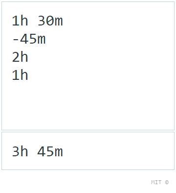

# time-calculator

[![XO code style][codestyle-image]][codestyle-url]
[![Tested with TestCafe][testcafe-image]][testcafe-url]

[![Build Status][build-image]][build-url]

> Calculate time durations

Demo: [vovanr.github.io/time-calculator][demo]

## License
MIT © [Vladimir Rodkin](https://github.com/VovanR)

[demo]: https://vovanr.github.io/time-calculator

[codestyle-url]: https://github.com/xojs/xo
[codestyle-image]: https://img.shields.io/badge/code_style-XO-5ed9c7.svg?style=flat-square

[testcafe-url]: https://github.com/DevExpress/testcafe
[testcafe-image]: https://img.shields.io/badge/tested%20with-TestCafe-2fa4cf.svg?style=flat-square

[build-url]: https://github.com/VovanR/time-calculator/actions?query=workflow%3A%22End-to-End+Tests%22
[build-image]: https://img.shields.io/github/workflow/status/VovanR/time-calculator/End-to-End%20Tests?style=flat-square
